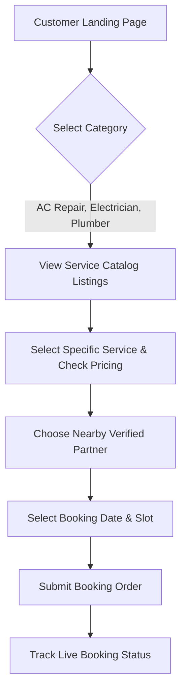

# 🚀 Business & Operations Guide: Local Service Hub
## 🌟 Zero to Hero: Platform Business, Operation Flow aur Monetization Plan

Aapka **Local Service Hub** platform bilkul **Urban Company** ya **Housejoy** ki tarah design kiya gaya hai. Ye ek **Double-Sided Marketplace** hai jo local customer ko verified service partners (Electricians, Plumbers, AC mechanics, etc.) ke sath connect karta hai.

---

## 💰 Part 1: Paisa Kaise Kamayein? (Monetization Model)
Marketplace platforms bohot profitable hote hain kyunki aapko khud workers hire nahi karne padte; aap sirf technology aur trust handle karte hain. Platform chalane wala (Admin) in 4 tareeqon se paisa kamayega:

### 1. Commission Model (Sabse Bada Revenue Engine)
* **Kaise kaam karta hai:** Har completed booking par aap (Platform Owner) service provider se **10% se 20%** tak commission kaatenge.
* **Example:** Ek customer ne "AC Jet Wash" book kiya jiski value **₹600** thi.
  * Customer ne payment kiya: ₹600.
  * Aapka Commission (15%): **₹90** directly aapke account me gaya.
  * Partner payout: **₹510** partner ko transfer hua.
  * Agar din me sirf **50 bookings** hoti hain, toh aapki daily direct income **₹4,500** (approx ₹1.35 Lakhs per month) hogi!

### 2. Lead Generation Model (Pay-per-Lead)
* **Kaise kaam karta hai:** Agar partner directly service details provide kar raha hai, toh aap custom booking leads deliver karne ka fixed price charge kar sakte hain (e.g. ₹50 per lead).
* **Example:** Kisi consumer ko ghar me renovation karwana hai. Aap leads generate karke local vendors ko deliver karenge aur unse matching fee charge karenge.

### 3. Subscription & Verification Fee (KYC Trust Stamp)
* **Kaise kaam karta hai:** Service providers trust badge lene ke liye bekar profile ke mukable verification fee pay karte hain.
  * **Trust Seal:** Partner onboarding validation charge (e.g. ₹499 one-time background check cost).
  * **Monthly Partner Subscriptions:** Premium partners se monthly fixed model charge karna (e.g., ₹299/month for unlimited listings).

### 4. Featured Placements (Ads / Boost Options)
* **Kaise kaam karta hai:** Providers search results ke top status par aane ke liye advertising fee pay karenge.
* **Example:** Dhanbad me 50 Electricians hain. Lekin "Rahul Electricals" top par aane ke liye ₹100/day pay karega. Aap use search page par **"FEATURED"** badge ke sath top spot par rank karenge.

---

## 👤 Part 2: User-Side Guide (Customer Journey)
Customer ki user journey ko bohot smooth aur frictionless rakha gaya hai taaki bookings fast scale ho sakein.

### User Operation Step-by-Step:
1. **Browse Categories:** Customer homepage par aakar dynamic categories (e.g. RO repair, Painter) explore karta hai.
2. **Catalog Page:** Specific category select karne par use sabhi individual service cards dikhte hain (e.g., *Ceiling Fan installation at ₹150*).
3. **Provider Selection:** Customer service select karke local providers ki profiles check karta hai (Reviews, experience, area verification).
4. **Checkout & Slot Allocation:** Consumer apna address daalkar comfortable slot (e.g., Wednesday at 4:00 PM) select karta hai.
5. **Real-time Tracker:** Customer panel par booking state dynamically show hoti hai:
   * 🟡 **Pending:** Booking request provider tak pahuch gayi hai.
   * 🟢 **Accepted:** Provider ne job confirm kar li hai aur aane ki taiyari hai.
   * 🔵 **In Progress:** Provider work spot par task start kar chuka hai.
   * ✅ **Completed:** Service done.

---

## 👑 Part 3: Admin-Side Guide (Operations Engine)
Admin panel is business ki back-bone hai. Admin saara control handle karta hai:

### 1. Onboarding Providers (KYC Validation)
* **Kyun zaroori hai:** Platform ki reliability trust par chalti hai. Customers ke ghar me unverified log bhejenge toh reputation damage hogi.
* **Operation Flow:**
  * Local providers frontend portal se register karte hain (Aadhaar, Business Name, Certifications upload karke).
  * Admin panel ke **`Verify Providers`** section me list show hoti hai.
  * Admin document validations ke baad click action ke sath use status **`Verified`** mark karta hai. Tabhi wo partner consumer app par active hota hai.

### 2. Service Management (Catalog Design)
* **Operation Flow:**
  * Admin **`Categories`** section me aakar nayi category create karta hai (e.g. Home Cleaning) aur image banner upload karta hai.
  * Phir **`Services`** section me aakar new service create karta hai (e.g. Deep Home Cleaning, ₹2999 base price, 180 mins duration).
  * **Assign Action (Imp):** Admin completed service ko specific verified local providers ke sath assign/map karta hai.

### 3. Order & Operations Monitoring
* **Operation Flow:**
  * **`Bookings List`** section me Admin saari current transactions aur ongoing orders track karta hai.
  * Agar koi partner customer ko attend nahi kar raha, toh Admin assign swap ya cancel handle kar sakta hai.

### 4. Support Ticket Management
* **Operation Flow:**
  * Consumer ya partner agar dispute raise karte hain, toh wo ticket **`Support Tickets`** me automatic routes ho jata hai.
  * Admin issue resolve karke ticket ko update ya close konto hai.

---

## 📈 Part 4: Market Expansion Strategy (Zero to Hero Launch Plan)

Agar aapko is business ko actual run karna hai, toh is step-by-step playbook ko follow karein:

### Phase 1: The "Cold Start" (Pehle Supply Ready Karo)
> [!IMPORTANT]
> Jab tak platform par service karne wale partners nahi honge, customer use nahi karenge. Isliye pehle Providers register karwao.
* **Bootstrapping:** Local markets me jao, local electricians/plumbers se baat karo. Unhe bolo: *"Platform par registration free hai, hum aapko direct customers ki bookings denge. Bas completed job par hum 10% commission lenge."*
* Onboard first **30-40 verified providers** in your target area before launching customer app.

### Phase 2: Hyper-Local Launch (Micro-Marketing)
* Apni launch area ko narrow rakho (e.g., target only a 5km radius or a single city/town like Dhanbad/Maithon).
* Facebook, Instagram aur WhatsApp groups par targeted ads chalao: *"First home service book karein aur 20% discount payein!"*

### Phase 3: Optimize & Automate
* Customer reviews ke basis par best performing partners ko boost karo (Featured placement monetization enable karo).
* Non-performing partners ko system filter out karega.

---

## 💎 Pro-Tips for Platform Owners:
> [!TIP]
> * **Standardized Pricing:** Hamesha pricing catalog fix rakhein (e.g. ₹150 for fan repair). Isse customer aur workers ke beech hidden price bargaining nahi hoti aur trust level boost hota hai.
> * **KYC Verification Checklist:** Aadhaar card/ID proof validation ke bina kisi bhi partner ko platform par approve na karein. Customer safety aapki top priority honi chahiye.

Aapka built application in saare business scenarios ko handle karne ke liye fully capable aur custom-ready hai!
