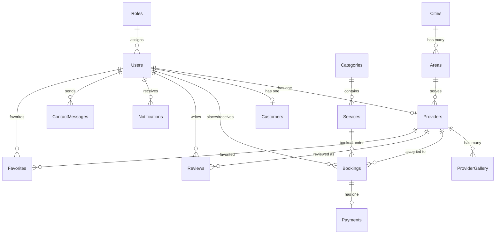

# Implementation Plan - Local Service Hub (Maithon)

This plan outlines the design and implementation steps for building the **Local Service Hub** marketplace application. The tech stack will consist of Node.js/Express/Sequelize/MySQL for the backend, and two Angular frontends (Customer/Provider and Admin Panel).

---

## User Review Required

Please review the proposed database schema, folder structure, and step-by-step execution roadmap below.
We will build the project module by module, starting with:
1. **Backend folder structure & DB configuration**
2. **Database Schema & Sequelize Models**
3. **Authentication Module (Sign up, Login, JWT + Refresh Token, Role Guards)**

> [!IMPORTANT]
> The database requires MySQL. Before starting, please ensure you have a running MySQL server and credentials (database name, username, password) ready.

---

## Proposed Database Schema

We will normalize the database and define the following Sequelize models:



### Table Definitions
1. **Roles**: `id`, `name` (Admin, Provider, Customer), `createdAt`, `updatedAt`
2. **Users**: `id`, `roleId` (FK), `name`, `email`, `passwordHash`, `phoneNumber`, `status` (Active, Inactive, Suspended), `refreshToken`, `createdAt`, `updatedAt`
3. **Customers**: `id`, `userId` (FK), `profilePicture`, `city`, `area`, `address`, `createdAt`, `updatedAt`
4. **Providers**: `id`, `userId` (FK), `businessName`, `experienceYears`, `skills` (JSON/text), `languages` (JSON/text), `workingHours` (JSON/text), `availabilityStatus` (Available, Busy, Offline), `pricing`, `kycStatus` (Pending, Verified, Rejected), `aadhaarPath`, `panPath`, `certificates` (JSON), `createdAt`, `updatedAt`
5. **Categories**: `id`, `name`, `icon`, `banner`, `slug`, `seoTitle`, `seoDescription`, `status` (Enabled, Disabled), `createdAt`, `updatedAt`
6. **Services**: `id`, `categoryId` (FK), `name`, `price`, `durationMinutes`, `description`, `images` (JSON), `requiredTools` (JSON), `status` (Active, Inactive), `createdAt`, `updatedAt`
7. **Bookings**: `id`, `customerId` (FK), `providerId` (FK), `serviceId` (FK), `bookingDate`, `bookingTime`, `status` (Pending, Accepted, Rejected, Completed, Cancelled), `price`, `address`, `pincode`, `statusTimeline` (JSON), `createdAt`, `updatedAt`
8. **Payments**: `id`, `bookingId` (FK), `transactionId`, `amount`, `paymentMethod`, `status` (Pending, Paid, Refunded), `createdAt`, `updatedAt`
9. **Reviews**: `id`, `bookingId` (FK), `customerId` (FK), `providerId` (FK), `rating` (1-5), `comment`, `status` (Approved, Hidden), `createdAt`, `updatedAt`
10. **ProviderGallery**: `id`, `providerId` (FK), `imagePath`, `createdAt`, `updatedAt`
11. **Cities**: `id`, `name`, `state`, `createdAt`, `updatedAt`
12. **Areas**: `id`, `cityId` (FK), `name`, `pincode`, `createdAt`, `updatedAt`
13. **Favorites**: `id`, `customerId` (FK), `providerId` (FK), `createdAt`, `updatedAt`
14. **Notifications**: `id`, `userId` (FK), `title`, `message`, `type` (Booking, Payment, General), `isRead`, `createdAt`, `updatedAt`
15. **ContactMessages**: `id`, `name`, `email`, `message`, `status` (Pending, Resolved), `createdAt`, `updatedAt`
16. **FAQs**: `id`, `question`, `answer`, `category` (General, Provider, Customer), `createdAt`, `updatedAt`

---

## Proposed Folder Structure

### Backend
```
backend/
├── config/
│   ├── db.config.js       # Database configuration & Sequelize init
│   └── auth.config.js     # JWT secret, refresh token secret, etc.
├── controllers/
│   ├── auth.controller.js
│   ├── user.controller.js
│   └── ...
├── middlewares/
│   ├── auth.middleware.js # JWT validation & role check
│   ├── upload.middleware.js # Multer configuration
│   └── error.middleware.js  # Global error handling
├── models/
│   ├── index.js           # Relations registration
│   ├── user.model.js
│   ├── role.model.js
│   └── ...
├── routes/
│   ├── auth.routes.js
│   ├── user.routes.js
│   └── ...
├── services/
│   ├── auth.service.js
│   └── ...
├── validators/
│   ├── auth.validator.js  # express-validator rules
│   └── ...
├── utils/
│   ├── logger.js          # Console/file logger
│   └── helper.js          # Helper functions
├── uploads/               # Profile pictures, Aadhaar/PAN, gallery files
├── logs/                  # System log files
├── .env                   # Environment variables (git ignored)
├── package.json
└── server.js              # Entry point
```

### Frontend (Customer/Provider Side) & Frontend (Admin Panel)
Both Angular projects will follow a standard layout:
```
frontend_*/
├── src/
│   ├── app/
│   │   ├── core/
│   │   │   ├── guards/       # AuthGuard, RoleGuard
│   │   │   ├── interceptors/ # AuthInterceptor (attaches token & handles 401 refresh)
│   │   │   └── services/     # Authservice, ApiService
│   │   ├── shared/
│   │   │   ├── components/   # Navbar, Sidebar, Spinner, Buttons
│   │   │   └── pipes/
│   │   ├── features/         # Lazy-loaded modules (Auth, Dashboard, Profile, Bookings)
│   │   ├── app-routing.module.ts
│   │   └── app.component.ts
│   └── assets/
└── ...
```

---

## Proposed Step-by-Step Execution Plan

### Step 1: Database Setup & Configuration
- Create database configuration connection in backend.
- Define config files and environment variables.

### Step 2: Database Schema & Sequelize Models Creation
- Define all models (`User`, `Role`, `Customer`, `Provider`, etc.).
- Establish relationships in `models/index.js`.
- Test connection and synchronization with the MySQL database.

### Step 3: Authentication Module & Security Middlewares
- Implement Register & Login controllers with BCrypt password hashing.
- Set up JWT tokens & Refresh token logic.
- Create JWT auth middleware and Role-based authorization middleware (Admin/Provider/Customer).
- Set up CORS, Helmet, and Rate Limiter configuration for security.

### Step 4: Admin Management Controllers & Routing
- Category and Service management endpoints.
- Provider approval/verification endpoints.
- User management and analytics dashboard API.

### Step 5: Customer Features API
- Services search by City, Area, Category, and Provider Name.
- Bookings API, favorites, and review endpoints.

### Step 6: Provider Features API
- Profile update (KYC documents upload), working hours, pricing.
- Accept/Reject booking endpoints, earnings dashboard analytics.

### Step 7: Frontend Setup - Customer Side (Angular)
- Create components for Home page, search, provider profiles, booking form, auth forms (login/register).
- Implement Guards and Interceptors.

### Step 8: Frontend Setup - Admin Side (Angular)
- Dashboard layout, Charts, verification details screen, categories list, bookings management screen.

---

## Verification Plan

### Automated Tests
- Postman Collection testing all REST endpoints with positive and negative inputs (valid/invalid tokens, incorrect roles).

### Manual Verification
1. Run local development servers for backend and Angular apps.
2. Sign up as a Service Provider, check MySQL database verification status.
3. Sign up as Customer, search for services, and make a booking.
4. Log into Admin panel, approve provider, see dashboard statistics update.
5. Accept the booking as Provider, mark as complete, review as Customer.
